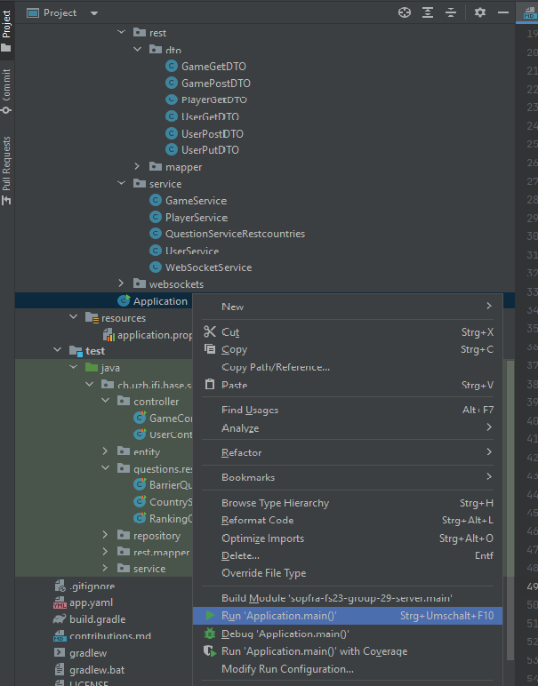

# Globalissimo - SoPra Project FS23, Group 29

**Test your geography knowledge in a fun board game, solo or with other players.**

Our goal is to provide a game that is not only fun to play, but also improves the players' geograhpical knowledge. Users can show off their skills in multiplayer games with up to 6 players, or challenge themselves in our two solo player game modes.

This repository contains the back end server side of the project. The client side can be found in [this repository](https://github.com/sopra-fs23-group-29/sopra-fs23-group-29-client)

## Technologies

The project uses the following technologies
- Spring Boot
- JPA
- WebSocket STOMP
- REST API
- Gradle
- Google Cloud Platform App Engine

The server side which is contained in this repository is written in Java with the usage of the Spring Boot framework and uses JPA for persistence.
The build is handled by Gradle and the deployment is done via Google Cloud Platforms App Engine.
To communicate with the client side, the project uses REST and websocket with a STOMP protocol.

## High-Level Components

All communication is received by the [controllers](https://github.com/sopra-fs23-group-29/sopra-fs23-group-29-server/tree/main/src/main/java/ch/uzh/ifi/hase/soprafs23/game/controller) which handle all requests. The controllers delegate the message to the [services](https://github.com/sopra-fs23-group-29/sopra-fs23-group-29-server/tree/main/src/main/java/ch/uzh/ifi/hase/soprafs23/game/service)
which handle all the game logic with the help of the [entity classes](https://github.com/sopra-fs23-group-29/sopra-fs23-group-29-server/tree/main/src/main/java/ch/uzh/ifi/hase/soprafs23/game/entity). The [questions](https://github.com/sopra-fs23-group-29/sopra-fs23-group-29-server/tree/main/src/main/java/ch/uzh/ifi/hase/soprafs23/game/controller) package handles all tasks regarding fetching country data and generating the questions needed to play the game. This package contains the connection to the [restcountries API](https://restcountries.com/) which is used to fetch country data.

### API Stability
Due to repeated problems with the used [API](https://restcountries.com) the [CountryService Class](/src/main/java/ch/uzh/ifi/hase/soprafs23/game/questions/restCountry/CountryService.java) is implemented with a fallback. Upon initialization of the service, it checks the responsiveness of the API. If the server is not online, the service uses static, locally stored [data](/src/main/resources/countriesV31.json) to generate questions. If the service operates in "offline" mode, each 60 seconds a new try to reach the API is launched. If successful, the service switches back to the online API.

## Launch & Deployment

### Build & Run locally

#### Build

You can use the local Gradle Wrapper to build the application.
-   macOS: `./gradlew`
-   Linux: `./gradlew`
-   Windows: `./gradlew.bat`

The wrapper should take care of all necessary steps to build the project. The java version is set to 17 in `build.gradle` in 
```
java {
    toolchain {
        languageVersion.set(JavaLanguageVersion.of(17))
    }
}
```


#### Run

To run the successfully built application, you have two options. Either use the wrapper to initiate a bootRun:
-   macOS: `./gradlew bootRun`
-   Linux: `./gradlew bootRun`
-   Windows: `./gradlew.bat bootRun`

or, if you're using IntelliJ IDEA, simply run the `Application.java` file in `main.java.ch.uzh.ifi.hase.soprafs23`



### Tests

The tests are located in `src.test` and are run automatically whenever you build or run the system.
Failing tests will prevent a successful build or launch.

### Deployment

The prod version of the application is deployed on the Google Cloud Platform (GCP) App Engine using a CI/CD pipeline through Github Actions. The steps upon push on the main branch are specified in this [yml file](.github/workflows/main.yml).

Upon push on main, all the test are run (using [sonarcloud](https://sonarcloud.io/projects) for test reports and metrics) and then the workflow tries to deploy the app.

This [link](https://console.cloud.google.com/appengine?referrer=search&hl=de&project=sopra-fs23-group-29-server&serviceId=default) takes you the GCP project.

## Authors and Acknowledgement

- **Dominik Arnold**
- **Nils Bohnenblust**
- **Thalia Lynn Fox**
- **Ramona Walker**
- **Mark Woolley**

We want to thank our teaching assistant Jerome Maier for the support during the semester and [Alejandro Matos](https://github.com/amatosg) for providing the great REST Countries API free of charge.

## Roadmap

- New question type: Find a given country on a map
- Global solo mode leaderboard
- Friends list and the possibility to invite friends


## License

MIT License

Copyright (c) [2023]

Permission is hereby granted, free of charge, to any person obtaining a copy
of this software and associated documentation files (the "Software"), to deal
in the Software without restriction, including without limitation the rights
to use, copy, modify, merge, publish, distribute, sublicense, and/or sell
copies of the Software, and to permit persons to whom the Software is
furnished to do so, subject to the following conditions:

The above copyright notice and this permission notice shall be included in all
copies or substantial portions of the Software.

THE SOFTWARE IS PROVIDED "AS IS", WITHOUT WARRANTY OF ANY KIND, EXPRESS OR
IMPLIED, INCLUDING BUT NOT LIMITED TO THE WARRANTIES OF MERCHANTABILITY,
FITNESS FOR A PARTICULAR PURPOSE AND NONINFRINGEMENT. IN NO EVENT SHALL THE
AUTHORS OR COPYRIGHT HOLDERS BE LIABLE FOR ANY CLAIM, DAMAGES OR OTHER
LIABILITY, WHETHER IN AN ACTION OF CONTRACT, TORT OR OTHERWISE, ARISING FROM,
OUT OF OR IN CONNECTION WITH THE SOFTWARE OR THE USE OR OTHER DEALINGS IN THE
SOFTWARE.
